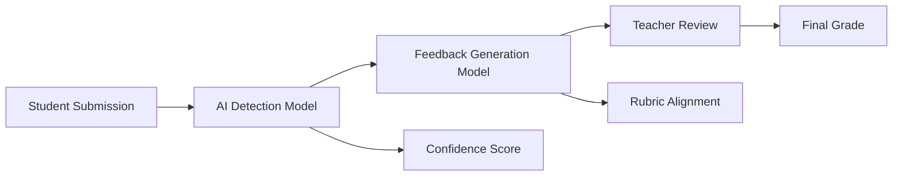

# AAIE System Architecture

## 🏗️ System Overview

AAIE consists of two core AI models working together to support educational assessment:

## 🤖 AI Detection Model

**Technology**: BERT-based binary classifier  
**Purpose**: Detect AI-generated content in student submissions  
**Features**:
- High accuracy (>85%) with low false positives
- Educational context awareness
- Confidence scoring for teacher review
- Real-time processing (<500ms response)

### Technical Details
- **Base Model**: BERT-base-uncased
- **Fine-tuning**: Educational text dataset
- **Output**: Binary classification + confidence score
- **Deployment**: FastAPI endpoint

## 📝 Feedback Generation Model

**Technology**: TinyLLaMA-based text generator  
**Purpose**: Generate rubric-aligned feedback for students  
**Features**:
- Context-aware feedback generation
- Rubric alignment and customization
- Explainable AI features
- Multi-format support (essays, code, reports)

### Technical Details
- **Base Model**: TinyLLaMA-1.1B
- **Fine-tuning**: Rubric-submission pairs
- **Output**: Structured feedback text
- **Deployment**: FastAPI endpoint

## 🔄 System Flow

## 🔌 Integration Points

### Learning Management Systems
- **CloudDeakin**: Primary LMS integration
- **OnTrack**: Secondary deployment option
- **API Endpoints**: RESTful APIs for model access
- **Database**: PostgreSQL for user data and logs

### External Services
- **Authentication**: Deakin SSO
- **File Storage**: AWS S3
- **Monitoring**: CloudWatch
- **Logging**: ELK Stack

## 🛠️ Technology Stack

### Backend
- **Language**: Python 3.9+
- **Framework**: FastAPI
- **ML Framework**: PyTorch, Transformers
- **Database**: PostgreSQL
- **Cache**: Redis

### Models
- **Detection**: BERT, Custom Tokenizers
- **Generation**: TinyLLaMA, SentencePiece
- **Evaluation**: Custom metrics

### Deployment
- **Containerization**: Docker
- **Orchestration**: Kubernetes
- **Cloud Platform**: AWS/GCP
- **CI/CD**: GitHub Actions

### Documentation
- **Static Site**: Astro + Starlight
- **API Docs**: OpenAPI/Swagger
- **Version Control**: Git with Git LFS

## 📊 Performance Metrics

### Detection Model
- **Accuracy**: >85%
- **False Positive Rate**: <5%
- **Response Time**: <500ms
- **Throughput**: 1000+ requests/minute

### Generation Model
- **BLEU Score**: >0.7
- **ROUGE Score**: >0.6
- **Response Time**: <2s
- **Throughput**: 100+ requests/minute

## 🔒 Security & Privacy

### Data Protection
- **Encryption**: AES-256 at rest and in transit
- **Anonymization**: Student data anonymized
- **Compliance**: FERPA, COPPA compliant
- **Audit Trail**: Complete access logging

### Model Security
- **Input Validation**: Strict schema validation
- **Rate Limiting**: API rate limiting
- **Authentication**: JWT tokens
- **Authorization**: Role-based access control

## 🚀 Deployment Architecture

### Development Environment
- **Local Development**: Docker Compose
- **Testing**: pytest, coverage
- **Code Quality**: Black, flake8, mypy

### Production Environment
- **Load Balancer**: AWS ALB
- **Auto Scaling**: Based on CPU/memory
- **Monitoring**: CloudWatch + custom metrics
- **Backup**: Daily automated backups

## 📈 Scalability Considerations

### Horizontal Scaling
- **Stateless Design**: All state in database/cache
- **Load Balancing**: Multiple instances
- **Database**: Read replicas for scaling

### Performance Optimization
- **Caching**: Redis for frequent queries
- **CDN**: Static assets via CloudFront
- **Compression**: gzip for API responses
- **Connection Pooling**: Database connections
